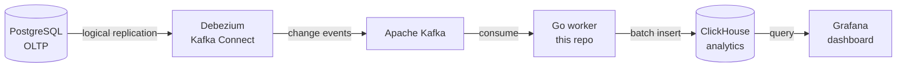

# 📐 Design

How the CDC pipeline works, and the reasoning behind each choice.

> [!NOTE]
> New here? Start with the [README](README.md) for the overview and quickstart.
> Want the build plan? See the [ROADMAP](ROADMAP.md).

---

## 🎯 Goal

Stream row changes from PostgreSQL into ClickHouse in near real time, so
analytics run on a fast columnar store that trails the live database by seconds.
The primary database is never touched by a query.

---

## 🗺️ Architecture



> [!TIP]
> See the pipeline in motion in the [README](README.md).

---

## 🧩 Components

| Component | Role |
| --------- | ---- |
| **PostgreSQL** | Source of truth. Runs with logical replication and a publication listing the captured tables. |
| **Debezium** | A Kafka Connect connector on the `pgoutput` plugin. Snapshots existing rows, then streams every insert, update, and delete as a JSON event. |
| **Apache Kafka** | Durable transport for change events. Runs in KRaft mode, so no ZooKeeper. |
| **Go worker** | This repo. Reads events, maps them to rows, batches them, and writes to ClickHouse. |
| **ClickHouse** | Columnar analytics store. Each source table lands as a `ReplacingMergeTree`. |
| **Grafana** | Dashboard over ClickHouse. Updates within seconds of a change in Postgres. |
| **Prometheus** | Scrapes the worker `/metrics` endpoint. |

---

## ⚙️ How it works

1. **Postgres** runs with `wal_level=logical` and a publication (`cdc_pub`) for
   the captured tables. The demo schema uses `REPLICA IDENTITY FULL`, so updates
   and deletes carry the full old row.
2. **Debezium** snapshots the existing rows, then streams every change as a JSON
   event onto a Kafka topic per table.
3. The **Go worker** reads those events, maps them to rows, batches them, and
   inserts into ClickHouse. It commits Kafka offsets only after a successful
   flush, so a crash loses nothing.
4. **ClickHouse** stores each table as a `ReplacingMergeTree` with a `_version`
   and an `_is_deleted` column. Updates collapse to the latest version, deletes
   become tombstones. Reads use `FINAL` and `_is_deleted = 0` for current state.
5. **Grafana** queries ClickHouse and renders a dashboard that updates within
   seconds of a write in Postgres.

---

## 📁 Repository layout

```
cmd/
  worker/        worker entrypoint (config + startup)
internal/
  consumer/      Kafka consumer
  debezium/      change event parsing
  model/         the internal ChangeEvent struct
  batch/         size triggered row buffer
  sink/          ClickHouse sink (mapping, flush)
  config/        worker configuration
deploy/
  postgres/      init SQL (schema, publication, replica identity)
  debezium/      connector config + register script
  clickhouse/    target table DDL
  grafana/       datasources + dashboards
docs/
  architecture.html   interactive diagram
```

---

## 🤔 Design decisions

> [!IMPORTANT]
> This is not a CDC engine built from scratch. Debezium handles the hard, solved
> part (reading the Postgres write ahead log) so the effort goes where it adds
> value: a Go service that lands changes into a columnar store correctly, plus
> the glue around it (one command stack, metrics, a live dashboard).

<details>
<summary><b>Why Debezium, not a hand written WAL reader</b></summary>

Reading the Postgres WAL by hand is a solved problem and a large surface to
maintain. Debezium keeps the focus on what is actually this project's value:
correct, observable delivery into ClickHouse.

</details>

<details>
<summary><b>Why ClickHouse</b></summary>

The point of this pipeline is fast analytics on operational data without
touching the primary. ClickHouse is a columnar store built for that, and
relational Postgres rows map to it cleanly.

</details>

<details>
<summary><b>Why ReplacingMergeTree</b></summary>

ClickHouse is built for appends. Encoding updates and deletes as versioned rows
(`_version`) plus tombstones (`_is_deleted`) is how you get correct upsert and
delete behavior in a columnar store. Reads use `FINAL` to collapse to the latest
version and filter out tombstones.

</details>

<details>
<summary><b>Why commit offsets after the flush</b></summary>

Committing only after ClickHouse acks a batch means a crash replays events
instead of dropping them. `ReplacingMergeTree` collapses the duplicate, so
delivery is exactly once in effect even though Kafka delivers at least once.

</details>

<details>
<summary><b>Why a dead letter topic for poison messages</b></summary>

A single malformed or unmappable event must not wedge the consumer. The worker
republishes the raw bytes (with the failure cause as Kafka headers) to a
`<topic>.dlq` topic, increments `cdc_dlq_total`, and keeps going. The send blocks
before the offset advances, so a poison message is quarantined or replayed, never
silently dropped.

</details>

<details>
<summary><b>Why in process retry instead of a queue for backpressure</b></summary>

A slow or paused ClickHouse must not let memory grow without bound. The consume
loop is a single goroutine, so when a flush fails it retries with capped backoff
and stops polling Kafka until the sink recovers. That blocking is the
backpressure: no new records are fetched, no offset advances, the buffer cannot
grow past one batch, and it resumes the moment ClickHouse comes back. A
connection read timeout makes a paused server surface as a retryable error rather
than a hang.

</details>

<details>
<summary><b>Why a Go worker, not the ready made ClickHouse sink connector</b></summary>

A connector would remove the Go entirely. Writing the sink in Go is a deliberate
choice: control over batching and mapping, and ownership of the CDC behavior end
to end. In production the ready made connector would be worth a second look.

</details>

---

## ✅ Delivery and correctness

| Property | How it holds |
| -------- | ------------ |
| **No data loss** | Offsets commit only after the ClickHouse flush acks. A crash between flush and commit replays the batch. |
| **No duplicates in effect** | `ReplacingMergeTree` dedupes replayed rows on `_version`, so at least once delivery reads as exactly once. |
| **Ordering** | Per key order is preserved through Kafka partitions and the monotonic `_version`. The latest write wins after merge. |
| **Full state, not just changes** | Debezium snapshots existing rows before streaming, so ClickHouse converges to the complete source state. |

---

## 🔬 Verifying correctness

Three scripts drive the full stack end to end and assert the guarantees above,
so correctness is proven rather than assumed. Each exits non zero on any failure.

| Script | Proves |
| ------ | ------ |
| `deploy/verify-snapshot.sh` | Debezium's initial snapshot lands in ClickHouse, and later streaming changes arrive with no loss or duplicates. |
| `deploy/verify-restart.sh` | The worker resumes from its committed offset after repeated `kill -9` under load. The ClickHouse `FINAL` view matches Postgres exactly: equal row counts and an all column checksum. |
| `deploy/verify-parity.sh` | After a fixed mix of inserts, updates, and deletes, the `FINAL` view matches Postgres by both row count and content checksum, catching any dropped update or delete. |

```sh
bash deploy/verify-snapshot.sh             # verify against the current stack
bash deploy/verify-restart.sh --fresh      # cold start: docker compose down -v first
CYCLES=5 bash deploy/verify-restart.sh     # more kill and restart cycles
```

Pass `--fresh` to drop all volumes for a true cold start, or omit it to verify an
already running stack.

---

## 🚧 Out of scope (for now)

See the [ROADMAP](ROADMAP.md) for the full list. Highlights: more sources, schema
evolution, multi tenancy, and a control plane API (gRPC and REST) with a
Kubernetes operator to manage pipelines.
