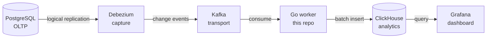

<div align="center">

# ⚡ CDC Pipeline

**Real time Change Data Capture from PostgreSQL to ClickHouse, with a live Grafana dashboard.**

Row changes flow out of the operational database and into a fast columnar store
in seconds. The primary is never touched by a query.

[](https://github.com/khangpt2k6/CDC/actions/workflows/ci.yml)


<br/>


</div>

---

## 🔁 The flow



> [!NOTE]
> Debezium reads the Postgres write ahead log and Kafka carries the events. The
> Go worker in this repo lands them in ClickHouse correctly, then Grafana shows
> the result within seconds.

---

## 🚀 Quickstart

```sh
docker compose up -d                       # bring up the full stack
./deploy/debezium/register-connector.sh    # register the Postgres connector
make run                                    # start the Go worker
# open Grafana and watch it update as Postgres changes
```

> [!TIP]
> Credentials are local only dev defaults. Tear everything down with
> `docker compose down -v`.

---

## 🧱 Stack

| Layer | Tech |
| ----- | ---- |
| Source | **PostgreSQL** with logical replication |
| Capture | **Debezium** on Kafka Connect (`pgoutput`) |
| Transport | **Apache Kafka** in KRaft mode |
| Worker | **Go** (this repo) |
| Analytics | **ClickHouse** (`ReplacingMergeTree`) |
| Dashboard | **Grafana** |
| Metrics | **Prometheus** |
| Local stack | **Docker Compose** |
| CI | **GitHub Actions** |

**Prerequisites:** Go 1.26+, Docker + Docker Compose,
[golangci-lint](https://golangci-lint.run) v2.

---

## 📚 Docs

| Doc | What is inside |
| --- | -------------- |
| **[DESIGN.md](DESIGN.md)** | How it works and why, with the tradeoffs spelled out. |
| **[ROADMAP.md](ROADMAP.md)** | The phase by phase build plan. |

---

<div align="center">

Built as a focused take on a real backend problem: correct, observable delivery
into a columnar store.

</div>
