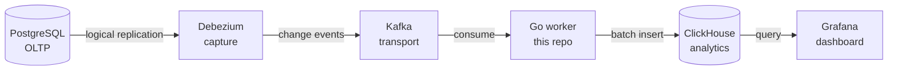

<div align="center">

# ⚡ CDC Pipeline

**Real time Change Data Capture from PostgreSQL to ClickHouse, with a live Grafana dashboard.**

Row changes flow out of the operational database and into a fast columnar store
in seconds. The primary is never touched by a query.

[](https://github.com/khangpt2k6/Slipstream_CDC/actions/workflows/ci.yml)


<br/>


</div>

---

## 🔁 The flow



> [!NOTE]
> Debezium reads the Postgres write ahead log and Kafka carries the events. The
> Go worker in this repo lands them in ClickHouse correctly, then Grafana shows
> the result within seconds.

---

## 🚀 Quickstart

```sh
docker compose up -d                       # bring up the full stack
./deploy/debezium/register-connector.sh    # register the Postgres connector
make run                                    # start the Go worker
# open Grafana and watch it update as Postgres changes
```

> [!TIP]
> Credentials are local only dev defaults. Tear everything down with
> `docker compose down -v`.

### One-command demo

```sh
bash deploy/demo.sh            # or --fresh for a cold start
```

`deploy/demo.sh` does the whole sequence for you: brings the stack up, registers
the connector, builds and runs the worker, and starts a load generator writing a
steady stream of inserts/updates/deletes to Postgres. It prints the Grafana
(`:3000`) and Prometheus (`:9090`) URLs and stays running so you can watch the
**CDC Analytics** panels move and consumer lag stay near zero on **CDC Pipeline
Health**. Press Ctrl-C to stop — it removes the generated rows and leaves the
stack up.

### Services

| Service | Address | Notes |
| ------- | ------- | ----- |
| Postgres | `localhost:5432` | user / pass / db = `cdc` |
| Kafka | `localhost:29092` | PLAINTEXT bootstrap for host clients |
| Kafka Connect | `http://localhost:8083` | Debezium connector REST API |
| ClickHouse | `localhost:8123` / `9000` | HTTP / native |
| Grafana | `http://localhost:3000` | provisioned dashboards (anonymous admin, local-dev) |
| Prometheus | `http://localhost:9090` | scrapes the worker `/metrics` |

Datasources (Prometheus + ClickHouse) and dashboards are **provisioned** from
`deploy/grafana/` and `deploy/prometheus/` — nothing to click. Two dashboards
load under the **CDC** folder:

- **CDC Pipeline Health** (Prometheus) — throughput, consumer lag, flush latency,
  errors. Prometheus scrapes the worker at `host.docker.internal:9100`, so the
  worker must be running on the host (`make run`) for it to populate.
- **CDC Analytics (ClickHouse)** — the payoff: live customers/orders, revenue,
  orders by status, top customers, customers by country, all over the
  current-state view (`FINAL WHERE _is_deleted = 0`). Panels reflect Postgres
  writes within seconds.

---

## 🧱 Stack

| Layer | Tech |
| ----- | ---- |
| Source | **PostgreSQL** with logical replication |
| Capture | **Debezium** on Kafka Connect (`pgoutput`) |
| Transport | **Apache Kafka** in KRaft mode |
| Worker | **Go** (this repo) |
| Analytics | **ClickHouse** (`ReplacingMergeTree`) |
| Dashboard | **Grafana**, metrics by **Prometheus** |
| Local stack | **Docker Compose**, CI by **GitHub Actions** |

**Prerequisites:** Go 1.26+, Docker + Docker Compose,
[golangci-lint](https://golangci-lint.run) v2.

## 🛠️ Common tasks

```sh
make build   # build worker binary
make test    # run tests
make lint    # go vet + golangci-lint
make run     # run the worker against the local stack
```

---

## 📚 Docs

| Doc | What is inside |
| --- | -------------- |
| **[DESIGN.md](DESIGN.md)** | How it works, the tradeoffs, and how correctness is proven. |
| **[ROADMAP.md](ROADMAP.md)** | The phase by phase build plan. |

---

<div align="center">

Built as a focused take on a real backend problem: correct, observable delivery
into a columnar store.

</div>
